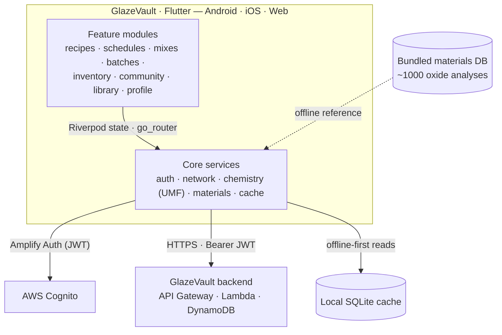

# GlazeVault

A cross-platform ceramic glazing application for potters. Built with Flutter and powered by AWS.

## Architecture

A feature-first Flutter app — one codebase targeting Android, iOS, and web — that talks to a serverless AWS backend, with **offline-first caching** and **client-side glaze chemistry** so the calculator and materials reference work with no network.



**Structure** — `lib/features/*` (recipes, schedules, mixes, batches, inventory, community, library, profile, settings, shell) holds screens and feature logic; `lib/core/*` holds cross-cutting services:

- **`chemistry`** — an on-device **UMF / Seger calculator** (Stull-chart position, mole %, formula readouts) that runs offline over the bundled materials data.
- **`materials`** — repository over the ~1,000-material oxide dataset.
- **`cache`** — offline-first response caching (SQLite), so the library and saved recipes work without a connection.
- **`network`** — typed HTTP client that attaches the Cognito JWT to backend calls.
- **`auth`** — Amplify Cognito (email + Google/Facebook).
- **`router` / state** — `go_router` navigation; Riverpod state management (with codegen).

**Highlights:** one codebase across three platforms; offline-first (chemistry, materials reference, and cached reads work with no network); the UMF math runs on-device, so the calculator is instant and round-trip-free.

## Features

- **Recipe Management** — create and track glaze recipes with full linear revision history
- **UMF Chemistry Calculator** — Stull chart visualization, extended UMF, mole %, and formula readouts
- **AI Recipe Generation** — describe a glaze and get an ingredient list powered by Amazon Bedrock
- **Firing Schedule Builder** — build and share firing schedules, link multiple schedules to any recipe
- **Batch Calculator** — scale recipes to a target weight, set water ratio, check against your inventory
- **Test Tile Journaling** — track test batches with per-tile notes, photos, and outcome records
- **Material Inventory** — track studio materials with automatic consumption deduction
- **Community Feed** — browse public recipes and firing schedules, follow potters, heart your favorites
- **Library** — searchable materials reference (1000+ materials, sourced from Digitalfire) and glaze chemistry knowledge base

## Tech Stack

| Layer | Technology |
|-------|-----------|
| Framework | Flutter |
| State Management | Riverpod |
| Navigation | go_router |
| Local Storage | SQLite |
| Platforms | Android, iOS, Web |
| Backend | [vitrify-backend](https://github.com/sormin-the-red/vitrify-backend) |

## Platform Priority

| Platform | Status |
|----------|--------|
| Android | Primary development target |
| iOS | Supported |
| Web | Supported |

## Getting Started

```bash
# Install dependencies
flutter pub get

# Run on connected device (Android primary)
flutter run

# Build
flutter build apk       # Android
flutter build ios       # iOS
flutter build web       # Web
```

## Backend

AWS infrastructure and Lambda functions live in [vitrify-backend](https://github.com/sormin-the-red/vitrify-backend).

## Materials Database

The materials reference database (~1000+ materials) is sourced from [Digitalfire](https://digitalfire.com) by Tony Hansen and is bundled as a local asset for offline use.
